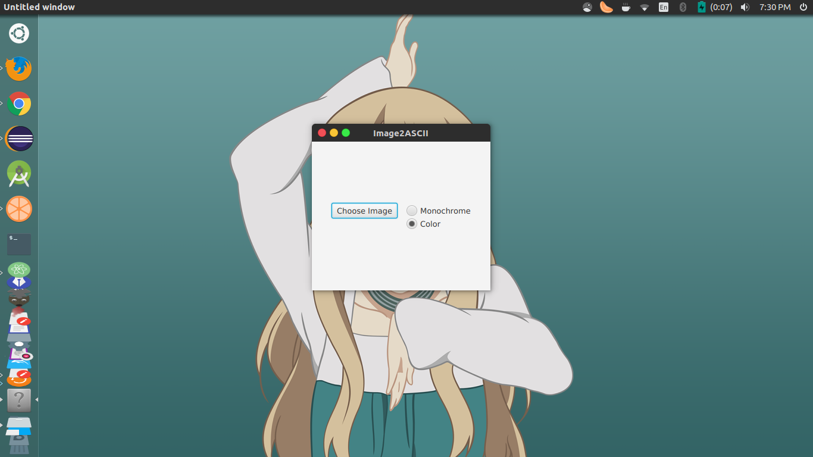
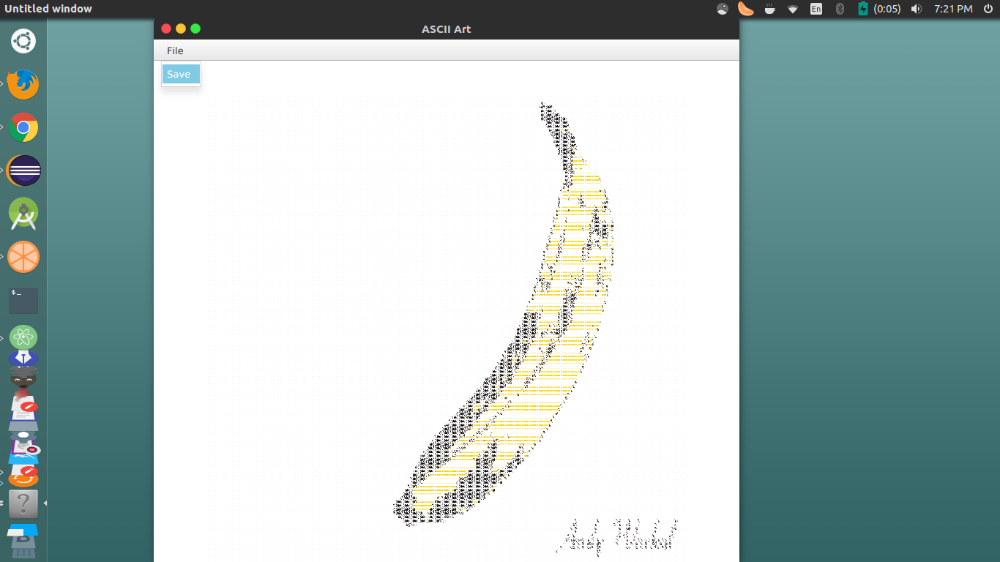
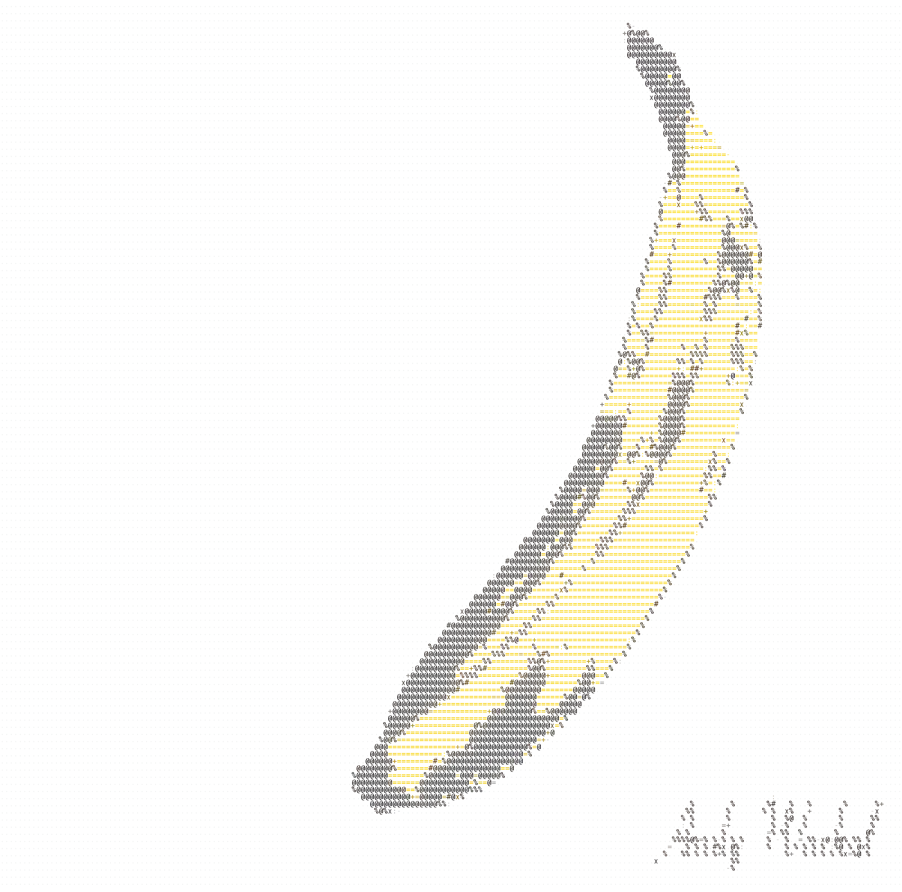
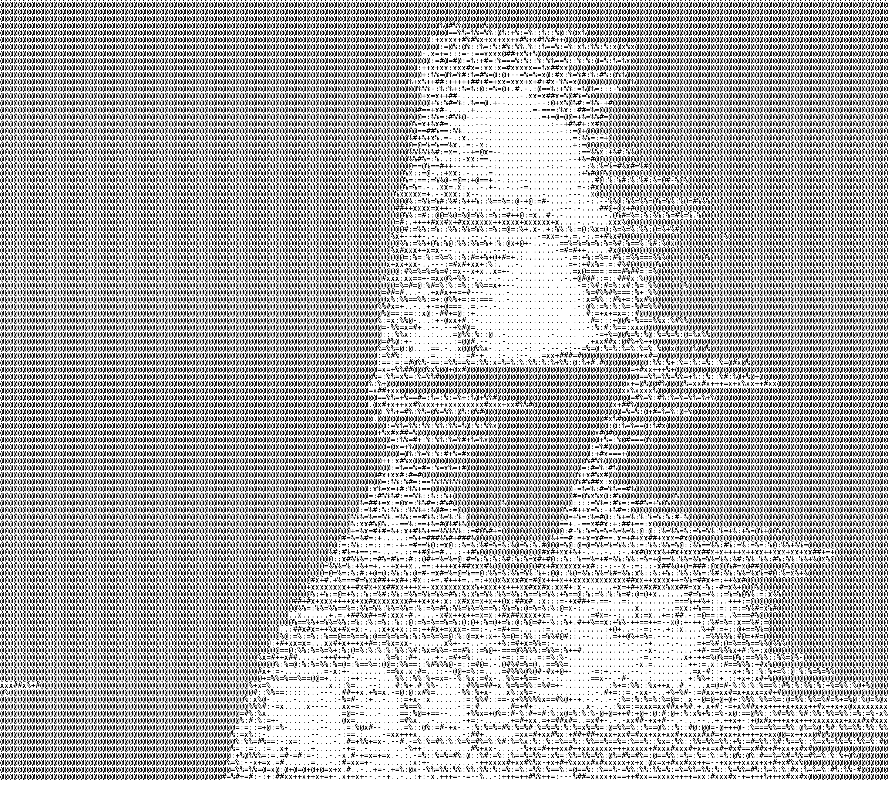

# Ascii

A basic image to ASCII converter. A user can choose an image and then save the ASCII version of it.

## Features

User is prompted to choose an image to convert into ASCII art and is given the choice between a colored version or a monochromatic version.

After an image is chosen, a separate window appears dislpaying the ASCII art. The user can zoom in and out and save the image.

## Examples

A few examples of ASCII art I created with this program.

## TODO

* Add CSS to make the GUI visually appealing
